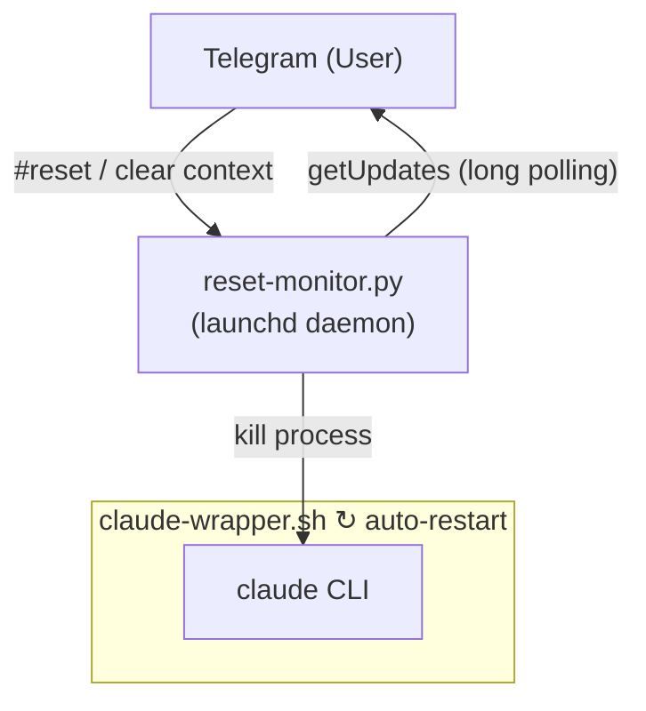

# claude-tg-reset

> Remote reset Claude Code session via Telegram commands.

[](LICENSE)
[]()
[]()

When using Claude Code via the Telegram channel (CCC), there's no built-in way to clear the conversation context remotely. This plugin solves that by adding a lightweight monitor daemon that listens for reset commands from Telegram and automatically restarts the Claude Code session with a fresh context.

## Features

- Remotely reset Claude Code context from Telegram
- Auto-restart after reset — no manual intervention needed
- Multi-language trigger commands (English / 中文)
- Runs as a macOS launchd background service
- One-click install / uninstall

## Architecture



## Prerequisites

- **macOS** (launchd-based service management)
- **Python 3** (standard library only, no pip install required)
- **[Claude Code](https://code.claude.com)** CLI installed
- **[Telegram plugin](https://github.com/anthropics/claude-code-plugins)** configured with a bot token

## Installation

**Option 1: One-liner**

```bash
curl -fsSL https://raw.githubusercontent.com/robin-li/claude-tg-reset/main/get.sh | bash
```

**Option 2: Clone from GitHub**

```bash
git clone https://github.com/robin-li/claude-tg-reset.git
cd claude-tg-reset
./install.sh
```

**Option 3: Install as Claude Code plugin**

```
/plugin install claude-tg-reset
```

Then run the installer to set up the launchd service:

```bash
~/.claude/plugins/marketplaces/*/claude-tg-reset/install.sh
```

## Usage

### Start Claude Code with auto-restart wrapper

```bash
# Default working directory (~)
~/.claude/scripts/claude-wrapper.sh

# Specify working directory
~/.claude/scripts/claude-wrapper.sh ~/workspace/my-project

# Specify model
~/.claude/scripts/claude-wrapper.sh ~/workspace --model opus
```

### Reset via Telegram

Send any of these commands to your Telegram bot:

| Command | Language |
|---------|----------|
| `#reset` | Universal |
| `reset` | English |
| `clear context` / `reset context` | English |
| `reset session` | English |
| `清除 context` / `清除context` | 中文 |
| `重置 session` / `重置session` | 中文 |

### Stop the wrapper

```bash
touch ~/.claude/scripts/.stop
```

## Uninstallation

If you cloned the repo:

```bash
cd claude-tg-reset
./uninstall.sh
```

Or run directly via one-liner:

```bash
curl -fsSL https://raw.githubusercontent.com/robin-li/claude-tg-reset/main/uninstall.sh | bash
```

This removes the launchd service, monitor script, and wrapper script.

## Project Structure

```
claude-tg-reset/
├── .claude-plugin/
│   └── plugin.json          # Plugin metadata
├── src/
│   └── reset_monitor.py     # Telegram polling daemon
├── bin/
│   └── claude-wrapper.sh    # Auto-restart wrapper
├── skills/
│   └── tg-reset/
│       └── SKILL.md         # /tg-reset skill definition
├── get.sh                   # One-liner remote installer
├── install.sh               # One-click installer
├── uninstall.sh             # One-click uninstaller
├── README.md
└── LICENSE
```

## How It Works

1. **`install.sh`** copies scripts to `~/.claude/scripts/` and registers a launchd service that starts `reset_monitor.py` on login.
2. **`reset_monitor.py`** long-polls the Telegram Bot API (`getUpdates`). When a reset command is received from an authorized user (based on `~/.claude/channels/telegram/access.json`), it kills the running Claude Code process.
3. **`claude-wrapper.sh`** runs Claude Code in an infinite loop. When the process is killed by the monitor, it waits 3 seconds and restarts with a fresh session.

## License

[MIT](LICENSE)
