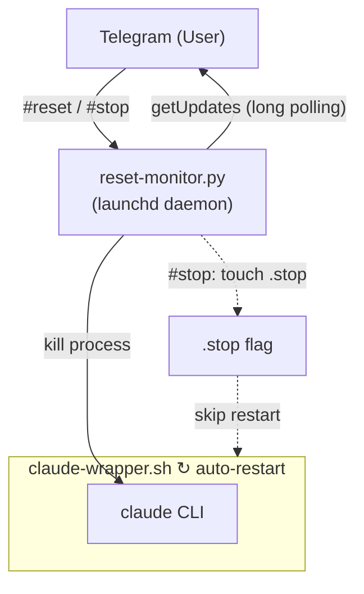

# claude-tg-reset

> Đặt lại phiên Claude Code từ xa thông qua lệnh Telegram.

[](LICENSE)
[]()
[]()

**[English](README.md)** | **[繁體中文](README.zh-TW.md)** | **[简体中文](README.zh-CN.md)** | **Tiếng Việt**

Khi sử dụng Claude Code qua Telegram Channel (CCC), không có cách nào để xóa context cuộc hội thoại từ xa. Plugin này giải quyết vấn đề đó bằng một daemon giám sát nhẹ, lắng nghe lệnh đặt lại từ Telegram và tự động khởi động lại phiên Claude Code.

## Tính năng

- Đặt lại context Claude Code từ xa qua Telegram
- Tự động khởi động lại sau khi đặt lại, không cần thao tác thủ công
- Lệnh kích hoạt đa ngôn ngữ (English / 中文)
- Chạy như dịch vụ nền macOS launchd
- Cài đặt / gỡ cài đặt một lệnh

## Kiến trúc



## Yêu cầu

- **macOS** (quản lý dịch vụ launchd)
- **Python 3** (chỉ dùng thư viện chuẩn, không cần pip install)
- **[Claude Code](https://code.claude.com)** CLI đã cài đặt
- **[Telegram plugin](https://github.com/anthropics/claude-code-plugins)** đã cấu hình bot token

## Cài đặt

**Cách 1: Một lệnh duy nhất**

```bash
curl -fsSL https://raw.githubusercontent.com/robin-li/claude-tg-reset/main/get.sh | bash
```

**Cách 2: Clone từ GitHub**

```bash
git clone https://github.com/robin-li/claude-tg-reset.git
cd claude-tg-reset
./install.sh
```

**Cách 3: Cài đặt như plugin Claude Code**

```
/plugin install claude-tg-reset
```

Sau đó chạy script cài đặt để thiết lập dịch vụ launchd:

```bash
~/.claude/plugins/marketplaces/*/claude-tg-reset/install.sh
```

## Cách sử dụng

### Khởi động Claude Code với wrapper tự động khởi động lại

```bash
# Thư mục làm việc mặc định (~)
~/.claude/scripts/claude-wrapper.sh

# Chỉ định thư mục làm việc
~/.claude/scripts/claude-wrapper.sh ~/workspace/my-project

# Chỉ định model
~/.claude/scripts/claude-wrapper.sh ~/workspace --model opus
```

### Đặt lại qua Telegram

Gửi bất kỳ lệnh nào sau đây đến Telegram bot của bạn:

| Lệnh | Ngôn ngữ |
|------|----------|
| `#reset` | Chung |
| `reset` | English |
| `clear context` / `reset context` | English |
| `reset session` | English |
| `清除 context` / `清除context` | 中文 |
| `重置 session` / `重置session` | 中文 |

### Dừng Claude Code qua Telegram

Gửi bất kỳ lệnh nào sau đây để dừng wrapper (sẽ KHÔNG tự động khởi động lại):

| Lệnh | Ngôn ngữ |
|------|----------|
| `#stop` | Chung |
| `停止ccc` / `停止 ccc` | 中文 |
| `停止claude` / `停止 claude` | 中文 |

### Dừng wrapper thủ công

```bash
touch ~/.claude/scripts/.stop
```

## Gỡ cài đặt

Nếu bạn đã clone repo:

```bash
cd claude-tg-reset
./uninstall.sh
```

Hoặc chạy lệnh một dòng:

```bash
curl -fsSL https://raw.githubusercontent.com/robin-li/claude-tg-reset/main/uninstall.sh | bash
```

Lệnh này sẽ xóa dịch vụ launchd, script giám sát và wrapper script.

## Cấu trúc dự án

```
claude-tg-reset/
├── .claude-plugin/
│   └── plugin.json          # Metadata plugin
├── src/
│   └── reset_monitor.py     # Daemon polling Telegram
├── bin/
│   └── claude-wrapper.sh    # Wrapper tự động khởi động lại
├── skills/
│   └── tg-reset/
│       └── SKILL.md         # Định nghĩa skill /tg-reset
├── get.sh                   # Script cài đặt từ xa
├── install.sh               # Script cài đặt
├── uninstall.sh             # Script gỡ cài đặt
├── README.md
└── LICENSE
```

## Cách hoạt động

1. **`install.sh`** sao chép script vào `~/.claude/scripts/` và đăng ký dịch vụ launchd, để `reset_monitor.py` tự động khởi động khi đăng nhập.
2. **`reset_monitor.py`** long-poll Telegram Bot API (`getUpdates`) để lắng nghe tin nhắn. Khi nhận được lệnh đặt lại từ người dùng được ủy quyền (dựa trên `~/.claude/channels/telegram/access.json`), nó sẽ kết thúc tiến trình Claude Code đang chạy.
3. **`claude-wrapper.sh`** chạy Claude Code trong vòng lặp vô hạn. Khi tiến trình bị kết thúc, nó đợi 3 giây rồi tự động khởi động lại phiên mới.

## Giấy phép

[MIT](LICENSE)
