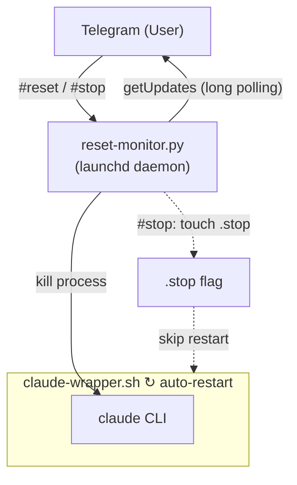

# claude-tg-reset

> 通过 Telegram 命令远程重置 Claude Code session。

[](LICENSE)
[]()
[]()

**[English](README.md)** | **[繁體中文](README.zh-TW.md)** | **简体中文** | **[Tiếng Việt](README.vi.md)**

通过 Telegram Channel（CCC）使用 Claude Code 时，无法从远程清除对话 context。本插件通过一个轻量级的监听 daemon，接收 Telegram 的重置指令并自动重启 Claude Code session。

## 功能特性

- 从 Telegram 远程重置 Claude Code context
- 重置后自动重启，无需手动干预
- 多语言触发命令（English / 中文）
- 以 macOS launchd 后台服务运行
- 一键安装 / 卸载

## 架构



## 前置要求

- **macOS**（launchd 服务管理）
- **Python 3**（仅使用标准库，无需 pip install）
- **[Claude Code](https://code.claude.com)** CLI 已安装
- **[Telegram plugin](https://github.com/anthropics/claude-code-plugins)** 已配置 bot token

## 安装

**方式一：一键安装**

```bash
curl -fsSL https://raw.githubusercontent.com/robin-li/claude-tg-reset/main/get.sh | bash
```

**方式二：从 GitHub Clone**

```bash
git clone https://github.com/robin-li/claude-tg-reset.git
cd claude-tg-reset
./install.sh
```

**方式三：以 Claude Code 插件安装**

```
/plugin install claude-tg-reset
```

然后运行安装脚本以设置 launchd 服务：

```bash
~/.claude/plugins/marketplaces/*/claude-tg-reset/install.sh
```

## 使用方式

### 以自动重启 wrapper 启动 Claude Code

```bash
# 默认工作目录 (~)
~/.claude/scripts/claude-wrapper.sh

# 指定工作目录
~/.claude/scripts/claude-wrapper.sh ~/workspace/my-project

# 指定模型
~/.claude/scripts/claude-wrapper.sh ~/workspace --model opus
```

### 通过 Telegram 重置

向你的 Telegram bot 发送以下任一命令：

| 命令 | 语言 |
|------|------|
| `#reset` | 通用 |
| `reset` | English |
| `clear context` / `reset context` | English |
| `reset session` | English |
| `清除 context` / `清除context` | 中文 |
| `重置 session` / `重置session` | 中文 |

### 通过 Telegram 停止 Claude Code

发送以下任一命令以停止 wrapper（不会自动重启）：

| 命令 | 语言 |
|------|------|
| `#stop` | 通用 |
| `停止ccc` / `停止 ccc` | 中文 |
| `停止claude` / `停止 claude` | 中文 |

### 手动停止 wrapper

```bash
touch ~/.claude/scripts/.stop
```

## 卸载

如果你有 clone repo：

```bash
cd claude-tg-reset
./uninstall.sh
```

或通过一键命令：

```bash
curl -fsSL https://raw.githubusercontent.com/robin-li/claude-tg-reset/main/uninstall.sh | bash
```

这会移除 launchd 服务、监听脚本和 wrapper 脚本。

## 项目结构

```
claude-tg-reset/
├── .claude-plugin/
│   └── plugin.json          # 插件 metadata
├── src/
│   └── reset_monitor.py     # Telegram 轮询 daemon
├── bin/
│   └── claude-wrapper.sh    # 自动重启 wrapper
├── skills/
│   └── tg-reset/
│       └── SKILL.md         # /tg-reset skill 定义
├── get.sh                   # 一键远程安装脚本
├── install.sh               # 一键安装脚本
├── uninstall.sh             # 一键卸载脚本
├── README.md
└── LICENSE
```

## 工作原理

1. **`install.sh`** 将脚本复制到 `~/.claude/scripts/`，并注册 launchd 服务，使 `reset_monitor.py` 在登录时自动启动。
2. **`reset_monitor.py`** 通过长轮询 Telegram Bot API（`getUpdates`）监听消息。收到授权用户的重置命令（依据 `~/.claude/channels/telegram/access.json`）后，终止正在运行的 Claude Code 进程。
3. **`claude-wrapper.sh`** 在无限循环中运行 Claude Code。进程被终止后，等待 3 秒自动重启新 session。

## 许可证

[MIT](LICENSE)
