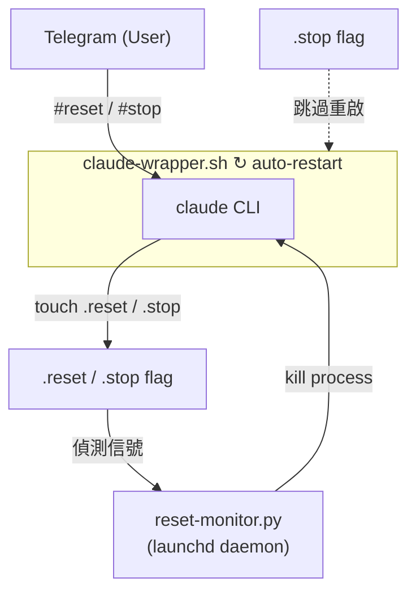

# claude-tg-reset

> 透過 Telegram 指令遠端重置 Claude Code session。

[](LICENSE)
[]()
[]()

**[English](README.md)** | **繁體中文** | **[简体中文](README.zh-CN.md)** | **[Tiếng Việt](README.vi.md)**

透過 Telegram Channel（CCC）使用 Claude Code 時，無法從遠端清除對話 context。本插件透過一個輕量級的檔案信號監聽 daemon，偵測信號檔案並自動重啟 Claude Code session。透過 Telegram 發送的重置指令由 Claude 自行處理並寫入信號檔案，monitor 偵測後重啟進程。

## 功能特色

- 從 Telegram 遠端重置 Claude Code context
- 重置後自動重啟，無需手動介入
- 多語言觸發指令（English / 中文）
- 以 macOS launchd 背景服務運行
- 一鍵安裝 / 解除安裝

## 架構



## 前置需求

- **macOS**（launchd 服務管理）
- **Python 3**（僅使用標準庫，無需 pip install）
- **[Claude Code](https://code.claude.com)** CLI 已安裝
- **[Telegram plugin](https://github.com/anthropics/claude-code-plugins)** 已設定 bot token

## 安裝

**方式一：一鍵安裝**

```bash
curl -fsSL https://raw.githubusercontent.com/robin-li/claude-tg-reset/main/get.sh | bash
```

**方式二：從 GitHub Clone**

```bash
git clone https://github.com/robin-li/claude-tg-reset.git
cd claude-tg-reset
./install.sh
```

**方式三：以 Claude Code 插件安裝**

```
/plugin install claude-tg-reset
```

然後執行安裝腳本以設定 launchd 服務：

```bash
~/.claude/plugins/marketplaces/*/claude-tg-reset/install.sh
```

## 使用方式

### 以自動重啟 wrapper 啟動 Claude Code

```bash
# 預設工作目錄 (~)
~/.claude/scripts/claude-wrapper.sh

# 指定工作目錄
~/.claude/scripts/claude-wrapper.sh ~/workspace/my-project

# 指定模型
~/.claude/scripts/claude-wrapper.sh ~/workspace --model opus
```

### 透過 Telegram 重置

向你的 Telegram bot 發送以下任一指令 — Claude 會處理指令並觸發重置：

| 指令 | 語言 |
|------|------|
| `#reset` | 通用 |
| `reset` | English |
| `clear context` / `reset context` | English |
| `reset session` | English |
| `清除 context` / `清除context` | 中文 |
| `重置 session` / `重置session` | 中文 |

### 透過 Telegram 停止 Claude Code

發送以下任一指令以停止 wrapper（不會自動重啟）：

| 指令 | 語言 |
|------|------|
| `#stop` | 通用 |
| `停止ccc` / `停止 ccc` | 中文 |
| `停止claude` / `停止 claude` | 中文 |

### 手動重置 / 停止（透過終端或 SSH）

```bash
# 重置（自動重啟）
touch ~/.claude/scripts/.reset

# 停止（不重啟）
touch ~/.claude/scripts/.stop
```

## 解除安裝

如果你有 clone repo：

```bash
cd claude-tg-reset
./uninstall.sh
```

或透過一鍵指令：

```bash
curl -fsSL https://raw.githubusercontent.com/robin-li/claude-tg-reset/main/uninstall.sh | bash
```

這會移除 launchd 服務、監聽腳本和 wrapper 腳本。

## 專案結構

```
claude-tg-reset/
├── .claude-plugin/
│   └── plugin.json          # 插件 metadata
├── src/
│   └── reset_monitor.py     # 檔案信號監聽 daemon
├── bin/
│   └── claude-wrapper.sh    # 自動重啟 wrapper
├── skills/
│   └── tg-reset/
│       └── SKILL.md         # /tg-reset skill 定義
├── get.sh                   # 一鍵遠端安裝腳本
├── install.sh               # 一鍵安裝腳本
├── uninstall.sh             # 一鍵解除安裝腳本
├── README.md
└── LICENSE
```

## 運作原理

1. **`install.sh`** 將腳本複製到 `~/.claude/scripts/`，並註冊 launchd 服務，使 `reset_monitor.py` 在登入時自動啟動。
2. **`reset_monitor.py`** 監控信號檔案（`~/.claude/scripts/.reset` 和 `~/.claude/scripts/.stop`）。偵測到信號檔案後，終止正在運行的 Claude Code 進程。`.reset` 處理後刪除（wrapper 自動重啟）；`.stop` 保留（wrapper 停止）。
3. **`claude-wrapper.sh`** 在無限迴圈中執行 Claude Code。進程被終止後，等待 3 秒自動重啟新 session。
4. 使用者透過 Telegram 發送重置/停止指令時，Claude 會直接處理並寫入對應的信號檔案，monitor 隨後偵測並執行。

## 授權條款

[MIT](LICENSE)
